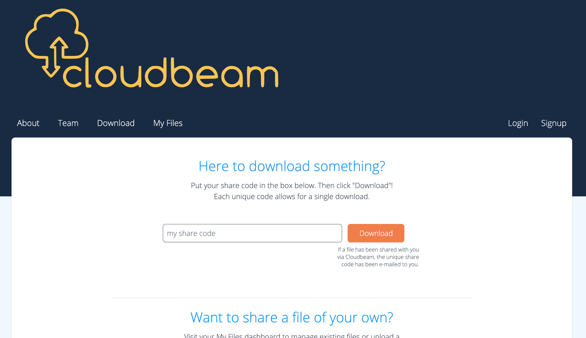
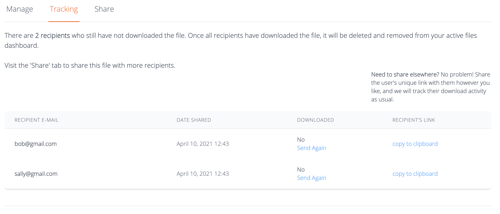
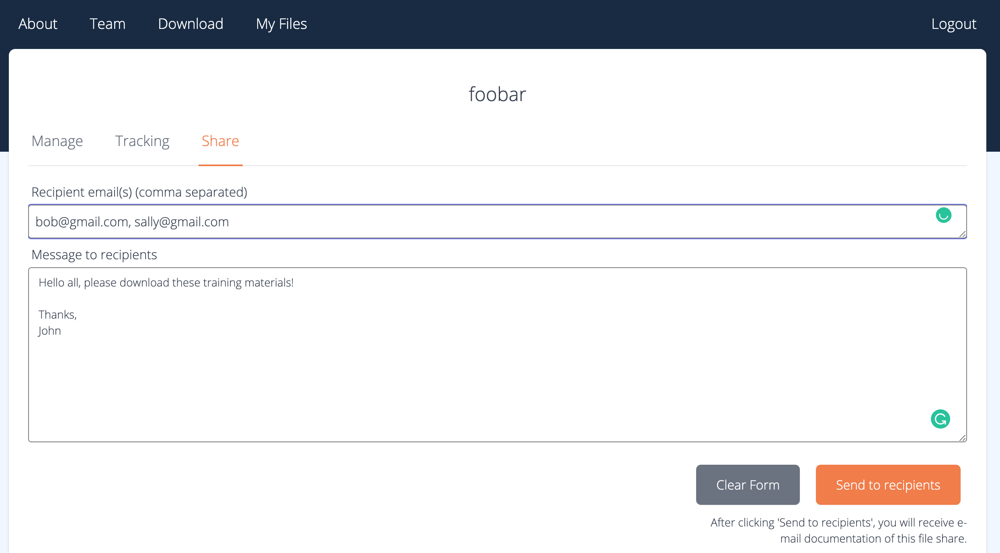

# ⚠️ This project is no longer actively maintained ⚠️

# Cloudbeam  :cloud:

## :hammer: Built with
- [Rails 6](https://guides.rubyonrails.org/) and Ruby 2.6.6
- [Tailwind CSS](https://v2.tailwindcss.com/docs)
- [Heroku](https://www.heroku.com/)
- [AWS S3](https://aws.amazon.com/s3) storage
- [AWS Cloudfront](https://aws.amazon.com/cloudfront/) distribution
- [PostgreSQL](https://www.postgresql.org/)
- [Mailgun](https://www.mailgun.com/)

## Visit on the web :earth_americas:
:stop_sign: As of January 9th, 2025, we are no longer maintaining this site. Therefore, the below link will not work. Please refer to the screenshots in this README.md for reference.

[cloud-beam.com](https://www.cloud-beam.com)

## Try it out using our demo credentials :key:
- user: demo@cloud-beam.com
- password: 'Testing Our App 123#'

## About Cloudbeam

Cloudbeam is an application designed to make sharing a large file with a small group of people easier. Cloud drive solutions exist, but there's quite a bit of unforeseen legwork involved in what, at first glance, would appear to be a simple file share! 

Our solution leverages low-impact file storage in the cloud, competent and automatic tracking of file activity,  and automated distribution of secure download links, all to make the process of rapidly sharing a large file as safe and simple  as possible. 

Read on to find out more about the inner workings of the application, some of the challenges we faced when building this app, and how we addressed them.

### Direct Uploads with Active Storage

Cloudbeam leverages the `Active Storage` module in Rails to facilitate direct file uploads from the client to our secure AWS cloud storage setup. 

Compared to other file upload solutions in this sphere, `Active Storage` provides the ability to upload files directly from client to storage solution without requiring the intermediate step of sending the upload files through the application server, which drastically reduces server load, and it does so without requiring the modification of existing models with additional columns, making the adoption of such a setup relatively painless. It does this using only the Rails built-in (as of version 6.1.3) `Active Storage` module and the `aws-sdk-s3` gem, with some additional configuration. 

### Signed URLs

Content security was one of our main concerns when designing this application. To ensure the privacy and security of the stored files in our cloud environment, we opted to use an **Amazon Cloudfront** distribution configured to only allow access to content in Cloudbeam's private S3 bucket through the use of a **signed URL**, generated by the application only when a user requests to download content with their *unique*, and *unused*, share code. 

When the download code is generated, it is given *two important security features*: an **expiration time** and strict **IP address validation**. The expiration time ensures that the signed URL is invalidated by CloudFront after just three minutes. Cloudbeam also captures the IP address of the user requesting the download and will utilize that information as a piece of the signed URL. This means that if the signed URL is passed to a user with a different IP address, access to the content of that signed URL will be denied! We've enforced these measures to maintain a high level of security for each download so everyone can share with confidence. 

### Overriding Default Behavior of Downloaded Content

As an additional measure to keep downloads secure and simple, Cloudbeam only allows each user's unique download code to be used one time. However, this was somewhat at odds with some browsers, as they will default to displaying, rather than downloading, certain types of content (like images and PDFs). We wanted to make sure that the file was downloaded on the user's device regardless of browser's default behavior, so their one-time download wasn't lost if the browser closed unexpectedly.

The solution to this was to dictate that the *content should be served as an attachment*, and as such, downloaded regardless of underlying file type. Cloudbeam includes the query parameter `’response-content-disposition=attachment;’` as part of each signed URL, in order *to dictate that the response should be downloaded* as an attachment. It was also necessary to add an additional policy to our CloudFront distribution to instruct that the query string `response-content-disposition` should be white-listed and forwarded to S3. 

### Live Updates with ActionCable

One of the most convenient features of Cloudbeam is the *live notifications* sent to the uploader informing them of who downloaded a particular file. However, there were a number of moving pieces that all needed to be configured on both the front-end and back-end to make these live updates possible.

To broadcast user-specific live notifications, we had to configure WebSocket to only be sent to a particular session. Cloudbeam makes use of a session controller to set the `session[:user_id]` for each user, but as Rails does not provide the `session` variable in `connection.rb`, we had to ensure that it was manually set again in the session controller in `cookies.signed`, to make the specific broadcast of Websocket possible. 

On the client side, we needed to make sure that the user was displaying the correct file dashboard page, as the server broadcasts data based on a particular file.

### Configuring Mailgun Credentials

The automation of tracking and notification is an important component of the application. To create a smooth, automated email notification and distribution system, we used Mailgun SMTP. One challenge we faced with this setup though was securing the credentials required for complete functionality in both development and production environments. 

In the development environment, we stored the credentials in the encrypted `credentials.yml.enc` file and referenced the variables stored therein under the `development.rb` file in our SMTP configuration, like so: `user_name: Rails.application.credentials[:mailgun][:username]`. This kept the credentials secure and easily accessible during development. As we deployed this app through Heroku, we made use of Heroku's configuration variables to set and access these credentials in our production environment. 

### Recurring Rake Tasks with Heroku Scheduler

Cloudbeam has a handful of tasks that need to be run periodically, both to provide elements of the application's core functionality, like *automatic file removal*, and *routine tasks* that help to ensure the integrity and validity of our data and the storage environment as a whole.

These tasks are defined in Rails as custom Rake tasks, grouped under relevant namespaces, and run on a predetermined schedule using Heroku's add-on utility `Scheduler`. These jobs include removing documents that were uploaded over 30 days prior, or have expired (because of the completed download of the file by each document recipient). We also periodically scan the database for unattached files to remove from S3 and the database. These automated jobs keep the environment clean and prevent unused files from taking up space.

## Authors
- [Kyle LeDoux](https://github.com/kaledoux) - kaledoux@gmail.com
- [Jimmy Zheng](https://github.com/jimzhe842) - jimzhe842@gmail.com
- [Elizabeth Tackett](http://github.com/emctackett) - emctackett@gmail.com

## Development notes :computer:

### To run the app locally
-  `yarn install`
-  `bundle install`
-  `bin/rails s`

### Rake Tasks

**Development database spot checking:**
- `rake current_data:total_report`
- `rake current_data:report_users`
- `rake current_data:report_documents`
- `rake current_data:report_document_recipients`
- `rake current_data:report_attachments`
- `rake current_data:report_blobs`

### Testing locally
- `bin/rails t`

### Heroku data from the command line (must be a collaborator):
`heroku pg:psql`
